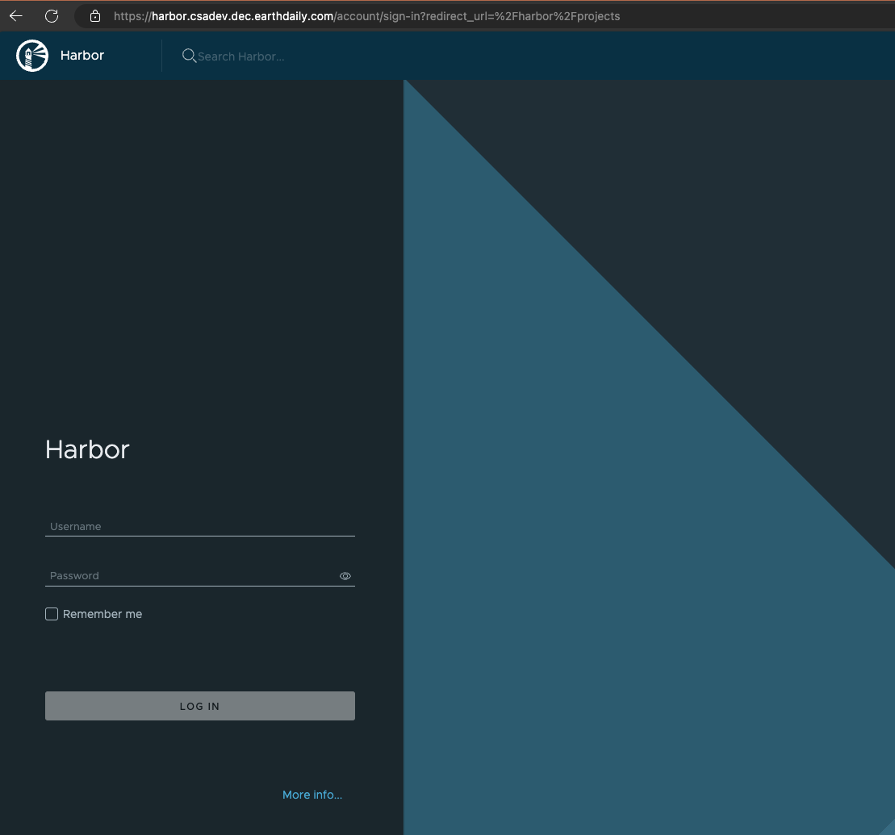

# BigWeather Use Case

This document explains the steps needed to execute the BigWeather using DEC.
The steps are:

* Build and upload Docker image (only needed if code)
* Update Workflow
* Deploy process
* Run process
* Monitor process
* Job Logs


## Build and upload Docker image
### Get access token
Use the following code to get the access token. Replace the variables `<VALUE>` by the appropriate values.

```bash
DOMAIN=<domain>
USERNAME=<username>
PASSWORD=<password>
CLIENT_ID=<client_id>
CLIENT_SECRET=<client_secret>
WORKSPACE=<workspace>

curl --location 'https://keycloak.${DOMAIN}.dec.earthdaily.com/
realms/master/protocol/openid-connect/token' \
--header 'Content-Type: application/x-www-form-urlencoded' \
--data-urlencode 'grant_type=password' \
--data-urlencode 'username=${USERNAME}' \
--data-urlencode 'password=${PASSWORD}' \
--data-urlencode 'client_secret=${CLIENT_SECRET}' \
--data-urlencode 'client_id=${CLIENT_ID}'
```
With a response:

```json
{
    "access_token": "token",
    "expires_in": 86400,
    "refresh_expires_in": 864000,
    "refresh_token": "token",
    "token_type": "Bearer",
    "not-before-policy": 0,
    "session_state": "c0872400-747d-4cdd-8744-8f944e778435",
    "scope": "profile email"
}
```

### Get Information about Workspace
Using the `access_token` provided on the step `Get access token`, get information about the workspace

```bash
TOKEN=<access_token>

curl --location 'https://workspace-api.${DOMAIN}.dec.earthdaily.com/
workspaces/ws-${WORKSPACE}' \
--header 'Authorization: Bearer ${TOKEN}'
```

The response will be:
```json
{
    "status": "ready",
    "endpoints": [
        {
            "id": "resource-protection",
            "url": "resource-catalogue.ws-${WORKSPACE}.${DOMAIN}.dec.earthdaily.com"
        }
    ],
    "storage": {
        "credentials": {
            "access": "",
            "bucketname": "",
            "projectid": "",
            "secret": "",
            "endpoint": "https://minio.${DOMAIN}.dec.earthdaily.com",
            "region": ""
        }
    },
    "container_registry": {
        "username": "",
        "password": "",
        "url": "https://harbor.${DOMAIN}.dec.earthdaily.com"
    }
}
```

### Login into Container Registry
Using the workspace information, login into docker registry giving the `username` and `password` from `container_registry`

```bash
docker login harbor.${DOMAIN}.dec.earthdaily.com
```

### Build docker image
To build the docker image edit the file `build-image.sh` and update the image name and version (if needed). Save and exit.

Execute the script `build-image.sh`
```bash
./build-image.sh
```

This step will build and upload the image into the workspace. 

**NOTE**: Assuming the build is done on a Linux/X86_64 environment.

All images will be uploaded into the Container Registry withing DEC on the following repository:
* `harbor.csadev.dec.earthdaily.com/bigweather`


### Manage docker images
Using the `container_registry` credentials obtained on the *Get Information about Workspace* section, user can manage the docker images.




## Update Workflow
The workflows are defined in the file `workflow_template.yaml`. This files can be edited accordingly.

### Workflow Parameters
The first part of the `workflow_template.yaml` is the information about the parameters. Is a section which contain the description for all the input parameters that are required to run the workflow. The structure is a list of elements containing `name`, `title`, `description` and `input_type`. Currently, the input_type is limited to `string` and we are working to expand this. However, this does not impact the ability to provide other input types, such as lists. The `input_type` defined on the `parameters` section is used only to provide the user information about the type used for that variable.

```yaml
parameters:
  - name: collection
    title: Collection
    description: The collection to process
    input_type: string
  - name: start_date
    title: Start Date
    description: The start date of the collection
    input_type: string
```

### Workflow Template
Workflow definition is composed by all the rest of the file (except the `parameters` section describe above). 

The `metadata` section contains information about the workflow. This section can be updated accordingly. `name` must but the same as provided when deploying the process (see *Deploy New Process* below).

The `spec` section contains the workflow definition. `entrypoint` specifies the name of the template that will be executed. Every `step` in the workflow is a template and defined in the `template` section.

For this workflow, we are using a template called `STEPS`. Argo accept different types of templates as documented [here](https://argo-workflows.readthedocs.io/en/latest/workflow-concepts/#template-types).

According to Argo Workflow docs: *A steps template allows you to define your tasks in a series of steps. The structure of the template is a "list of lists". Outer lists will run sequentially and inner lists will run in parallel.*

The steps and the steps definition template can be modified as needed.


### Argo Workflow Docs and Examples
* [Argo workflow Documentation](https://argo-workflows.readthedocs.io/en/stable/)
* [Parameters](https://argo-workflows.readthedocs.io/en/stable/walk-through/parameters/)
* [Steps](https://argo-workflows.readthedocs.io/en/stable/walk-through/steps/)
* [Spec](https://argo-workflows.readthedocs.io/en/stable/walk-through/the-structure-of-workflow-specs/)

* [Argo workflow examples](https://github.com/argoproj/argo-workflows/tree/main/examples)

## Deploy New Process
Once workflow template is ready, it can be deployed on the WPS server.
`PROCESS_NAME` should be the same as used inside the workflow template definition (`metadata.name`). The parameter `--data` contains the whole content for the `workflow-template.yaml` file.

```bash
PROCESS_NAME=<process_name>
curl --location 'https://zoo.${DOMAIN}.dec.earthdaily.com/
${WORKSPACE}/ogc-api/processes?w=${PROCESS_NAME}' \
--header 'Content-Type: application/cwl+yaml' \
--header 'accept: application/json' \
--header 'Authorization: Bearer ${TOKEN}' \
--data '<workflow-template file content>'
```

**Note:** Process name needs to be unique. 

### Update deployed process
If an existing workflow needs to be updated only, the following command can be used.

```bash
curl --location --request PUT 'https://zoo.${DOMAIN}.dec.earthdaily.com/
${WORKSPACE}/ogc-api/processes/${PROCESS_NAME}' \
--header 'Content-Type: application/cwl+yaml' \
--header 'accept: application/json' \
--header 'Authorization: Bearer ${TOKEN}' \
--data '<workflow-template updated file content>'
```

## Run process
After a process is deployed it's possible to run a job.

```bash
curl --location 'https://zoo.${DOMAIN}.dec.earthdaily.com/${WORKSPACE}/
ogc-api/processes/${PROCESS_NAME}/execution' \
--header 'Prefer: respond-async;return=representation' \
--header 'Content-Type: application/json' \
--header 'Authorization: Bearer ${TOKEN}' \
--data '{
    "inputs": {
        "x": "-123.116",
        "y": "49.288"
    }
}'
```
Options on `--data` can be modified accordingly. They are the same variables defined in the entrypoint argument parameters on the workflow definition.

The response of a submitted is information about the job.

```json
{
    "jobID": "f2ef3148-235d-11ef-b0be-0242ac11003f",
    "type": "process",
    "processID": "precipitations-profit",
    "created": "2024-06-05T17:06:28.977Z",
    "started": "2024-06-05T17:06:28.977Z",
    "updated": "2024-06-05T17:06:28.977Z",
    "status": "running",
    "message": "ZOO-Kernel accepted to run your service!",
    "links": [
        {
            "title": "Status location",
            "rel": "monitor",
            "type": "application/json",
            "href": "https://zoo.${DOMAIN}.dec.earthdaily.com/${WORKSPACE}/ogc-api/jobs/
            f2ef3148-235d-11ef-b0be-0242ac11003f"
        }
    ]
}
```

## Get job information
The WPS server offers an endpoint to get information about the running job. Using the `jobID`  obtained during the job submission is possible to track the job execution status.

```bash
JOB_ID=<job_id>

curl --location 'https://zoo.${DOMAIN}.dec.earthdaily.com/${WORKSPACE}/
ogc-api/jobs/${JOB_ID}' \
--header 'Authorization: Bearer ${TOKEN}'
```

Example of job status:

```json
{
    "progress": 10,
    "jobID": "f2ef3148-235d-11ef-b0be-0242ac11003f",
    "type": "process",
    "processID": "precipitations-profit",
    "created": "2024-06-05T17:06:28.977Z",
    "started": "2024-06-05T17:06:28.977Z",
    "updated": "2024-06-05T17:06:30.443Z",
    "status": "running",
    "message": "Workflow started",
    "links": [
        {
            "title": "Status location",
            "rel": "monitor",
            "type": "application/json",
            "href": "https://zoo.${DOMAIN}.dec.earthdaily.com/${WORKSPACE}/ogc-api/
            jobs/f2ef3148-235d-11ef-b0be-0242ac11003f"
        }
    ]
}
```

Once job is finished, the response returns more information which includes the job logs:

```json
{
    "jobID": "f2ef3148-235d-11ef-b0be-0242ac11003f",
    "type": "process",
    "processID": "precipitations-profit",
    "created": "2024-06-05T17:06:28.977Z",
    "started": "2024-06-05T17:06:28.977Z",
    "finished": "2024-06-05T17:08:02.534Z",
    "updated": "2024-06-05T17:08:01.642Z",
    "status": "successful",
    "message": "ZOO-Kernel successfully run your service!",
    "links": [
        {
            "title": "Status location",
            "rel": "monitor",
            "type": "application/json",
            "href": "https://zoo.${DOMAIN}.dec.earthdaily.com/${WORKSPACE}/
            ogc-api/jobs/f2ef3148-235d-11ef-b0be-0242ac11003f"
        },
        {
            "title": "Result location",
            "rel": "http://www.opengis.net/def/rel/ogc/1.0/results",
            "type": "application/json",
            "href": "https://zoo.${DOMAIN}.dec.earthdaily.com/${WORKSPACE}/
            ogc-api/jobs/f2ef3148-235d-11ef-b0be-0242ac11003f/results"
        },
        {
            "href": "https://zoo.${DOMAIN}.dec.earthdaily.com/temp/
            precipitations-profit-f2ef3148-235d-11ef-b0be-0242ac11003f/logs.log",
            "title": "Process execution log logs.log",
            "rel": "related",
            "type": "text/plain"
        }
    ]
}
```

Job logs can be obtained by using the link `Process execution log logs.log` returned when the job is finished.

```bash
URL=<value_from_job_info>
curl --location '${URL}' \
--header 'Authorization: Bearer ${TOKEN}'
```
